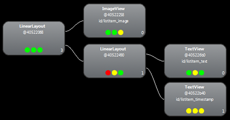
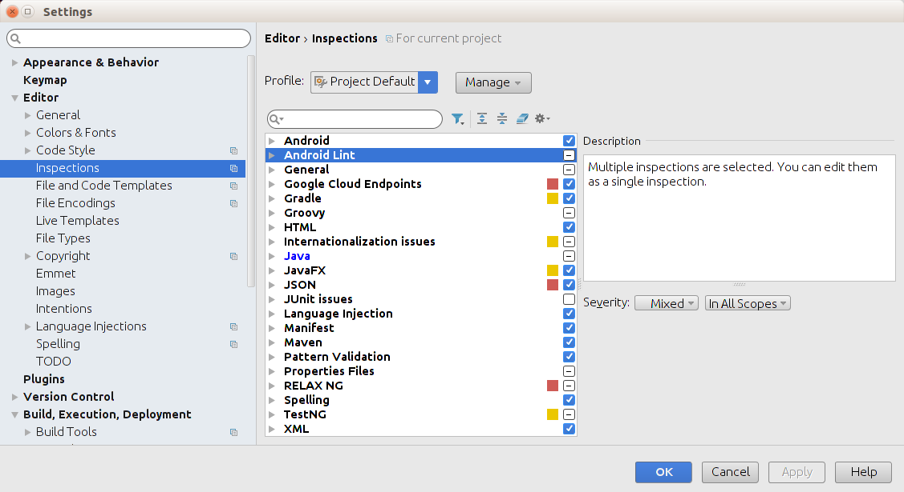

# 优化layout的层级

> 编写:[allenlsy](https://github.com/allenlsy) - 原文:<http://developer.android.com/training/improving-layouts/optimizing-layout.html>

一个常见的误区是，用最基础的 Layout 结构可以提高 Layout 的 性能。然而，因为程序的每个组件和 Layout 都需要经过初始化、布局和绘制的过程，如果布局嵌套导致层级过深，上面的初始化，布局和绘制操作就更加耗时。例如，使用嵌套的 LinearLayout 可能会使得 View 的层级结构过深，此外，嵌套使用了 `layout_weight` 参数的 LinearLayout 的计算量会尤其大，因为每个子元素都需要被测量两次。这对需要多次重复 inflate 的 Layout 尤其需要注意，比如嵌套在 ListView 或 GridView 时。

在本课中，你将学习使用 [Hierarchy Viewer](http://developer.android.com/tools/help/hierarchy-viewer.html)和[Layoutopt](http://developer.android.com/tools/help/layoutopt.html)来检查和优化 Layout。

## 检查 Layout

Android SDK 工具箱中有一个叫做 [Hierarchy Viewer](http://developer.android.com/tools/help/hierarchy-viewer.html) 的工具，能够在程序运行时分析 Layout。你可以用这个工具找到 Layout 的性能瓶颈。

Hierarchy Viewer 会让你选择设备或者模拟器上正在运行的进程，然后显示其 Layout 的树型结构。每个块上的交通灯分别代表了它在测量、布局和绘画时的性能，帮你找出瓶颈部分。

比如，下图是 ListView 中一个列表项的 Layout 。列表项里，左边放一个小位图，右边是两个层叠的文字。像这种需要被多次 inflate 的 Layout ，优化它们会有事半功倍的效果。

`hierarchyviewer` 这个工具在 `<sdk>/tools/` 中。当打开时，它显示一张可使用设备的列表，和它正在运行的组件。点击 **Load View Hierarchy** 来查看所选组件的层级。比如，下图就是前一个图中所示 Layout 的层级关系。

在上图中，你可以看到一个三层结构，其中右下角的 TextView 在布局的时候有问题。点击这个TextView可以看到每个步骤所花费的时间。

可以看到，渲染一个完整的列表项的时间就是：

* 测量: 0.977ms
* 布局: 0.167ms
* 绘制: 2.717ms

## 修正 Layout

上面的 Layout 由于有这个嵌套的 LinearLayout 导致性能太慢，可能的解决办法是将 Layout 层级扁平化 - 变浅变宽，而不是又窄又深。RelativeaLayout 作为根节点时就可以达到目的。所以，当换成基于 RelativeLayout 的设计时，你的 Layout 变成了两层。新的 Layout 变成这样：

现在渲染列表项的时间：

* 测量: 0.598ms
* 布局: 0.110ms
* 绘制: 2.146ms

可能看起来是很小的进步，但是由于它对列表中每个项都有效，这个时间要翻倍。

这个时间的主要差异是由于在 LinearLayout 中使用 `layout_weight` 所致，因为会减慢“测量”的速度。这只是一个正确使用各种 Layout 的例子，当你使用 `layout_weight` 时有必要慎重。

## 使用 Lint

> 大部分叫做 lint 的编程工具，都是类似于代码规范的检测工具。比如JSLint，CSSLinkt， JSONLint 等等。译者注。

运行 [Lint](http://tools.android.com/tips/lint) 工具来检查 Layout 可能的优化方法，是个很好的实践。Lint 已经取代了 Layoutopt 工具，它拥有更强大的功能。Lint 中包含的一些检测[规则](http://tools.android.com/tips/lint-checks)有：

* 使用compound drawable — 用一个compound drawable 替代一个包含 `ImageView` 和 `TextView` 的 `LinearLayout` 会更有效率。
* 合并根 frame — 如果 `FrameLayout` 是 Layout 的根节点，并且没有使用 padding 或者背景等，那么用 merge 标签替代他们会稍微高效些。
* 没用的子节点 — 一个没有子节点或者背景的 Layout 应该被去掉，来获得更扁平的层级
* 没用的父节点 — 一个节点如果没有兄弟节点，并且它不是 `ScrollView` 或根节点，没有背景，这样的节点应该直接被子节点取代，来获得更扁平的层级
* 太深的 Layout — Layout 的嵌套层数太深对性能有很大影响。尝试使用更扁平的 Layout ，比如 `RelativeLayout` 或 `GridLayout` 来提高性能。一般最多不超过10层。

另一个使用 Lint 的好处就是，它内置于 Android Studio 中。Lint 在你导编译程序时自动运行。Android Studio 中，你可以为单独的 build variant 或者所有 variant 运行 lint。

你也可以在 Android Studio 中管理检测选项，在 **File > Settings > Project Settings** 中。检测配置页面会显示支持的检测项目。

Lint 有自动修复、提示建议和直接跳转到问题处的功能。
