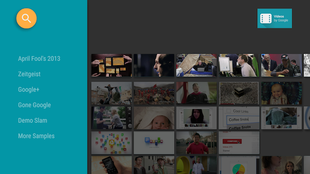
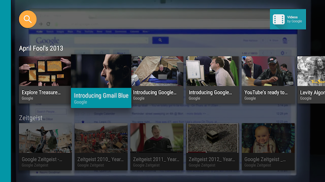

#提供一个Card视图

编写:[huanglizhuo](https://github.com/huanglizhuo) - 原文:<http://developer.android.com/training/tv/playback/card.html>


在前面的课程中，我们创建一个目录浏览器，实现了浏览 fragment，显示了媒体项目的列表。在本课程中，我们将创建该卡视图的媒体项目，并在浏览fragment中呈现出来。

[BaseCardView](http://developer.android.com/reference/android/support/v17/leanback/widget/BaseCardView.html)类以及子类显示与媒体项目相关联的元数据。在本节课程中使用的[ImageCardView](http://developer.android.com/reference/android/support/v17/leanback/widget/ImageCardView.html)类显示随着媒体项目的标题内容的图像。

这节课介绍了GitHub上 [ Android Leanback sample app](https://github.com/googlesamples/androidtv-Leanback)的示例应用程序代码。使用该示例代码，开始我们自己的应用程序。



##创建一个卡片呈现者

[Presenter](http://developer.android.com/reference/android/support/v17/leanback/widget/Presenter.html)生成视图并把类和它们绑定起来。在我们的浏览 fragment 中将内容呈现给用户,我们为内容卡片创建[Presenter](http://developer.android.com/reference/android/support/v17/leanback/widget/Presenter.html)并把它传给适配器然后将内容呈现在屏幕上。在下面的代码中,CardPresenter在[ LoaderManager](http://developer.android.com/reference/android/support/v4/app/LoaderManager.html)的[onLoadFinished](http://developer.android.com/reference/android/support/v4/app/LoaderManager.LoaderCallbacks.html#onLoadFinished(android.support.v4.content.Loader<D>, D))方法中被创建。

```xml
@Override
public void onLoadFinished(Loader<HashMap<String, List<Movie>>> arg0,
                           HashMap<String, List<Movie>> data) {

    mRowsAdapter = new ArrayObjectAdapter(new ListRowPresenter());
    CardPresenter cardPresenter = new CardPresenter();

    int i = 0;

    for (Map.Entry<String, List<Movie>> entry : data.entrySet()) {
        ArrayObjectAdapter listRowAdapter = new ArrayObjectAdapter(cardPresenter);
        List<Movie> list = entry.getValue();

        for (int j = 0; j < list.size(); j++) {
            listRowAdapter.add(list.get(j));
        }
        HeaderItem header = new HeaderItem(i, entry.getKey(), null);
        i++;
        mRowsAdapter.add(new ListRow(header, listRowAdapter));
    }

    HeaderItem gridHeader = new HeaderItem(i, getString(R.string.more_samples),
            null);

    GridItemPresenter gridPresenter = new GridItemPresenter();
    ArrayObjectAdapter gridRowAdapter = new ArrayObjectAdapter(gridPresenter);
    gridRowAdapter.add(getString(R.string.grid_view));
    gridRowAdapter.add(getString(R.string.error_fragment));
    gridRowAdapter.add(getString(R.string.personal_settings));
    mRowsAdapter.add(new ListRow(gridHeader, gridRowAdapter));

    setAdapter(mRowsAdapter);

    updateRecommendations();
}
```

##创建一个卡片视图

在这步中,我们将用view holder创建一个卡片presenter来为卡片视图呈现媒体项目。注意,每个presenter只能创建一个view类别。如果我们有俩个不同的卡片视图,我们就得创建俩个不同的presenter

在[presenter](http://developer.android.com/reference/android/support/v17/leanback/widget/Presenter.html)实现[onCreateViewHolder](http://developer.android.com/reference/android/support/v17/leanback/widget/Presenter.html#onCreateViewHolder(android.view.ViewGroup))时创建一个可以呈现内容项目的view holder。

```xml
@Override
public class CardPresenter extends Presenter {

    private Context mContext;
    private static int CARD_WIDTH = 313;
    private static int CARD_HEIGHT = 176;
    private Drawable mDefaultCardImage;

    @Override
    public ViewHolder onCreateViewHolder(ViewGroup parent) {
        mContext = parent.getContext();
        mDefaultCardImage = mContext.getResources().getDrawable(R.drawable.movie);
...
```

在[onCreateViewHolder](http://developer.android.com/reference/android/support/v17/leanback/widget/Presenter.html#onCreateViewHolder(android.view.ViewGroup))方法中,创建呈现内容的卡片视图。下面的例子用的是[ImageCardView](http://developer.android.com/reference/android/support/v17/leanback/widget/ImageCardView.html)

当卡片被选中时,默认的行为是放大展开。如果我们想创建不同颜色的卡片可以向下面这样调用[setSelected](http://developer.android.com/reference/android/support/v17/leanback/widget/BaseCardView.html#setSelected(boolean))方法中实现。

```xml
...
    ImageCardView cardView = new ImageCardView(mContext) {
        @Override
        public void setSelected(boolean selected) {
            int selected_background = mContext.getResources().getColor(R.color.detail_background);
            int default_background = mContext.getResources().getColor(R.color.default_background);
            int color = selected ? selected_background : default_background;
            findViewById(R.id.info_field).setBackgroundColor(color);
            super.setSelected(selected);
        }
    };
...
```

当用户打开我们的应用时,[Presenter.ViewHolder ](http://developer.android.com/reference/android/support/v17/leanback/widget/Presenter.ViewHolder.html)为内容项目显示了卡片视图。我们需要调用[setFocusable(true) ](http://developer.android.com/reference/android/view/View.html#setFocusable(boolean))和[setFocusableInTouchMode(true)](http://developer.android.com/reference/android/view/View.html#setFocusableInTouchMode(boolean))方法设置接收来自D-pad的焦点控制。

```xml
...
    cardView.setFocusable(true);
    cardView.setFocusableInTouchMode(true);
    return new ViewHolder(cardView);
}
```

当用户选中[ImageCardView](http://developer.android.com/reference/android/support/v17/leanback/widget/ImageCardView.html)时,它用我们制定的颜色背景展开文字内容,就像下面这样。



------------
[下一节：创建详细信息View >](detail.html)