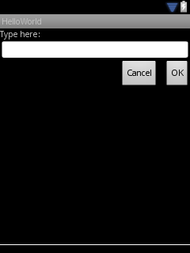
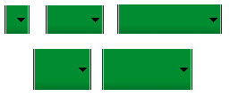

# 支持不同的屏幕大小

> 编写:[riverfeng](https://github.com/riverfeng) - 原文:<http://developer.android.com/training/multiscreen/screensizes.html>

这节课教你如何通过以下几种方式支持多屏幕：

1、确保你的布局能自适应屏幕

2、根据你的屏幕配置提供合适的UI布局

3、确保正确的布局适合正确的屏幕。

4、提供缩放正确的位图（bitmap）

## 使用“wrap_content”和“match_parent”

为了确保你的布局能灵活的适应不同的屏幕尺寸，针对一些view组件，你应该使用wrap_content和match_parent来设置他们的宽和高。如果你使用了wrap_content，view的宽和高会被设置为该view所包含的内容的大小值。如果是match_parent（在API 8之前是fill_parent）则会匹配该组件的父控件的大小。

通过使用wrap_content和match_parent尺寸值代替硬编码的尺寸，你的视图将分别只使用控件所需要的空间或者被拓展以填充所有有效的空间。比如：
```xml
<LinearLayout xmlns:android="http://schemas.android.com/apk/res/android"
    android:orientation="vertical"
    android:layout_width="match_parent"
    android:layout_height="match_parent">
    <LinearLayout android:layout_width="match_parent"
                  android:id="@+id/linearLayout1"
                  android:gravity="center"
                  android:layout_height="50dp">
        <ImageView android:id="@+id/imageView1"
                   android:layout_height="wrap_content"
                   android:layout_width="wrap_content"
                   android:src="@drawable/logo"
                   android:paddingRight="30dp"
                   android:layout_gravity="left"
                   android:layout_weight="0" />
        <View android:layout_height="wrap_content"
              android:id="@+id/view1"
              android:layout_width="wrap_content"
              android:layout_weight="1" />
        <Button android:id="@+id/categorybutton"
                android:background="@drawable/button_bg"
                android:layout_height="match_parent"
                android:layout_weight="0"
                android:layout_width="120dp"
                style="@style/CategoryButtonStyle"/>
    </LinearLayout>

    <fragment android:id="@+id/headlines"
              android:layout_height="fill_parent"
              android:name="com.example.android.newsreader.HeadlinesFragment"
              android:layout_width="match_parent" />
</LinearLayout>
```
注意上面的例子使用wrap_content和match_parent来指定组件尺寸而不是使用固定的尺寸。这样就能使你的布局正确的适配不同的屏幕尺寸和屏幕方向（这里的配置主要是指屏幕的横竖屏切换）。

例如，下图演示的就是该布局在竖屏和横屏模式下的效果，注意组件的尺寸是自动适应宽和高的。


图1：News Reader示例app（左边竖屏，右边横屏）。

## 使用相对布局（RelativeLayout）

你可以使用LinearLayout以及wrap_content和match_parent组合来构建复杂的布局，但是LinearLayout却不允许你精准的控制它子view的关系，子view在LinearLayout中只能简单一个接一个的排成行。如果你需要你的子view不只是简简单单的排成行的排列，更好的方法是使用RelativeLayout，它允许你指定你布局中控件与控件之间的关系，比如，你可以指定一个子view在左边，另一个则在屏幕的右边。
```xml
<?xml version="1.0" encoding="utf-8"?>
<RelativeLayout xmlns:android="http://schemas.android.com/apk/res/android"
    android:layout_width="match_parent"
    android:layout_height="match_parent">
    <TextView
        android:id="@+id/label"
        android:layout_width="match_parent"
        android:layout_height="wrap_content"
        android:text="Type here:"/>
    <EditText
        android:id="@+id/entry"
        android:layout_width="match_parent"
        android:layout_height="wrap_content"
        android:layout_below="@id/label"/>
    <Button
        android:id="@+id/ok"
        android:layout_width="wrap_content"
        android:layout_height="wrap_content"
        android:layout_below="@id/entry"
        android:layout_alignParentRight="true"
        android:layout_marginLeft="10dp"
        android:text="OK" />
    <Button
        android:layout_width="wrap_content"
        android:layout_height="wrap_content"
        android:layout_toLeftOf="@id/ok"
        android:layout_alignTop="@id/ok"
        android:text="Cancel" />
</RelativeLayout>
```


图2：QVGA（小尺寸屏幕）屏幕下截图


图3：WSVGA（大尺寸屏幕）屏幕下截图

> 注意：尽管组件的尺寸发生了变化，但是它的子view之间的空间关系还是通过RelativeLayout.LayoutParams已经指定好了。

## 使用尺寸限定词

（译者注：这里的限定词主要是指在编写布局文件时，将布局文件放在加上类似large，sw600dp等这样限定词的文件夹中，以此来告诉系统根据屏幕选择对应的布局文件，比如下面例子的layout-large文件夹）

从上一节的学习里程中，我们知道如何编写灵活的布局或者相对布局，它们都能通过拉伸或者填充控件来适应不同的屏幕，但是它们却不能为每个不同屏幕尺寸提供最好的用户体验。因此，你的应用不应该只是实现灵活的布局，同时也应该为不同的屏幕配置提供几种不同的布局方式。你可以通过配置限定（configuration qualifiers）来做这件事情，它能在运行时根据你当前设备的配置（比如不同的屏幕尺寸设计了不同的布局）来选择合适的布局资源。

 比如，很多应用都为大屏幕实现了“两个窗格”模式（应用可能在一个窗格中实现一个list的item，另外一个则实现list的content），平板和电视都是大到能在一个屏幕上适应两个窗格，但是手机屏幕却只能分别显示。所以，如果你想实现这些布局，你就需要以下文件：

res/layout/main.xml.单个窗格（默认）布局：

```xml
<LinearLayout xmlns:android="http://schemas.android.com/apk/res/android"
    android:orientation="vertical"
    android:layout_width="match_parent"
    android:layout_height="match_parent">

    <fragment android:id="@+id/headlines"
              android:layout_height="fill_parent"
              android:name="com.example.android.newsreader.HeadlinesFragment"
              android:layout_width="match_parent" />
</LinearLayout>
```

res/layout-large/main.xml,两个窗格布局：

```xml
<LinearLayout xmlns:android="http://schemas.android.com/apk/res/android"
    android:layout_width="fill_parent"
    android:layout_height="fill_parent"
    android:orientation="horizontal">
    <fragment android:id="@+id/headlines"
              android:layout_height="fill_parent"
              android:name="com.example.android.newsreader.HeadlinesFragment"
              android:layout_width="400dp"
              android:layout_marginRight="10dp"/>
    <fragment android:id="@+id/article"
              android:layout_height="fill_parent"
              android:name="com.example.android.newsreader.ArticleFragment"
              android:layout_width="fill_parent" />
</LinearLayout>
```

注意第二个布局文件的目录名字“large qualifier”，在大尺寸的设备屏幕时（比如7寸平板或者其他大屏幕的设备）就会选择该布局文件，而其他比较小的设备则会选择没有限定词的另一个布局（也就是第一个布局文件）。

## 使用最小宽度限定词

在Android 3.2之前，开发者还有一个困难，那就是Android设备的“large”屏幕尺寸，其中包括Dell Streak（设备名称），老版Galaxy Tab和一般的7寸平板，有很多的应用都想针对这些不同的设备（比如5和7寸的设备）定义不同的布局，但是这些设备都被定义为了large尺寸屏幕。也是因为这个，所以Android在3.2的时候开始使用最小宽度限定词。

最小宽度限定词允许你根据设备的最小宽度（dp单位）来指定不同布局。比如，传统的7寸平板最小宽度为600dp，如果你希望你的UI能够在这样的屏幕上显示两个窗格（不是一个窗格显示在小屏幕上），你可以使用上节中提到的使用同样的两个布局文件。不同的是，使用sw600来指定两个方框的布局使用在最小宽度为600dp的设备上。

res/layout/main.xml,单个窗格（默认）布局：
```xml
<LinearLayout xmlns:android="http://schemas.android.com/apk/res/android"
    android:orientation="vertical"
    android:layout_width="match_parent"
    android:layout_height="match_parent">

    <fragment android:id="@+id/headlines"
              android:layout_height="fill_parent"
              android:name="com.example.android.newsreader.HeadlinesFragment"
              android:layout_width="match_parent" />
</LinearLayout>
```

res/layout-sw600dp/main.xml,两个方框布局：
```xml
<LinearLayout xmlns:android="http://schemas.android.com/apk/res/android"
    android:layout_width="fill_parent"
    android:layout_height="fill_parent"
    android:orientation="horizontal">
    <fragment android:id="@+id/headlines"
              android:layout_height="fill_parent"
              android:name="com.example.android.newsreader.HeadlinesFragment"
              android:layout_width="400dp"
              android:layout_marginRight="10dp"/>
    <fragment android:id="@+id/article"
              android:layout_height="fill_parent"
              android:name="com.example.android.newsreader.ArticleFragment"
              android:layout_width="fill_parent" />
</LinearLayout>
```
这样意味着当你的设备的最小宽度等于600dp或者更大时，系统选择layout-sw600dp/main.xml（两个窗格）的布局，而小一点的屏幕则会选择layout/main.xml（单个窗格）的布局。
然而，在3.2之前的设备上，这样做并不是很好的选择。因为3.2之前还没有将sw600dp作为一个限定词出现，所以，你还是需要使用large限定词来做。因此，你还是应该要有一个布局文件名为res/layout-large/main.xml，和res/layout-sw600dp/main.xml一样。在下一节中，你将学到如何避免像这样出现重复的布局文件。

## 使用布局别名

最小宽度限定词只能在android3.2或者更高的版本上使用。因此，你还是需要使用抽象尺寸（small，normal，large，xlarge）来兼容以前的版本。比如，你想要将你的UI设计为在手机上只显示一个方框的布局，而在7寸平板或电视，或者其他大屏幕设备上显示多个方框的布局，你可能得提供这些文件：

* res/layout/main.xml：单个窗格布局

* res/layout-large：多个窗格布局

* res/layout-sw600dp：多个窗格布局

最后两个文件都是一样的，因为其中一个将会适配Android3.2的设备，而另外一个则会适配其他Android低版本的平板或者电视。
为了避免这些重复的文件（维护让人感觉头痛就是因为这个），你可以使用别名文件。比如，你可以定义如下布局：

* res/layout/main.xml，单个方框布局
* res/layout/main_twopans.xml，两个方框布局

然后添加这两个文件：

* res/values-large/layout.xml：

```xml
<resources>
    <item name="main" type="layout">@layout/main_twopanes</item>
</resources>
```
* res/values-sw600dp/layout.xml：
```xml
<resources>
    <item name="main" type="layout">@layout/main_twopanes</item>
</resources>
```
最后两个文件拥有相同的内容，但它们并没有真正意义上的定义布局。它们只是将main_twopanes设置成为了别名main，它们分别处在large和sw600dp选择器中，所以它们能适配Android任何版本的平板和电视（在3.2之前平板和电视可以直接匹配large，而3.2或者以上的则匹配sw600dp）。

## 使用方向限定词

有一些布局不管是在横向还是纵向的屏幕配置中都能显示的非常好，但是更多的时候，适当的调整一下会更好。在News Reader应用例子中，以下是布局在不同屏幕尺寸和方向的行为：

* 小屏幕，纵向：一个窗格加logo
* 小屏幕，横向：一个窗格加logo
* 7寸平板，纵向：一个窗格加action bar
* 7寸平板，横向：两个宽窗格加action bar
* 10寸平板，纵向：两个窄窗格加action bar
* 10寸平板，横向：两个宽窗格加action bar
* 电视，横向：两个宽窗格加action bar

这些每个布局都会在res/layout目录下定义一个xml文件，如此，应用就能根据屏幕配置的变化根据别名匹配到对应的布局来适应屏幕。

res/layout/onepane.xml：

```xml
<LinearLayout xmlns:android="http://schemas.android.com/apk/res/android"
    android:orientation="vertical"
    android:layout_width="match_parent"
    android:layout_height="match_parent">

    <fragment android:id="@+id/headlines"
              android:layout_height="fill_parent"
              android:name="com.example.android.newsreader.HeadlinesFragment"
              android:layout_width="match_parent" />
</LinearLayout>
```

res/layout/onepane_with_bar.xml:

```xml
<LinearLayout xmlns:android="http://schemas.android.com/apk/res/android"
    android:orientation="vertical"
    android:layout_width="match_parent"
    android:layout_height="match_parent">
    <LinearLayout android:layout_width="match_parent"
                  android:id="@+id/linearLayout1"
                  android:gravity="center"
                  android:layout_height="50dp">
        <ImageView android:id="@+id/imageView1"
                   android:layout_height="wrap_content"
                   android:layout_width="wrap_content"
                   android:src="@drawable/logo"
                   android:paddingRight="30dp"
                   android:layout_gravity="left"
                   android:layout_weight="0" />
        <View android:layout_height="wrap_content"
              android:id="@+id/view1"
              android:layout_width="wrap_content"
              android:layout_weight="1" />
        <Button android:id="@+id/categorybutton"
                android:background="@drawable/button_bg"
                android:layout_height="match_parent"
                android:layout_weight="0"
                android:layout_width="120dp"
                style="@style/CategoryButtonStyle"/>
    </LinearLayout>

    <fragment android:id="@+id/headlines"
              android:layout_height="fill_parent"
              android:name="com.example.android.newsreader.HeadlinesFragment"
              android:layout_width="match_parent" />
</LinearLayout>
```

res/layout/twopanes.xml:
```xml
<LinearLayout xmlns:android="http://schemas.android.com/apk/res/android"
    android:layout_width="fill_parent"
    android:layout_height="fill_parent"
    android:orientation="horizontal">
    <fragment android:id="@+id/headlines"
              android:layout_height="fill_parent"
              android:name="com.example.android.newsreader.HeadlinesFragment"
              android:layout_width="400dp"
              android:layout_marginRight="10dp"/>
    <fragment android:id="@+id/article"
              android:layout_height="fill_parent"
              android:name="com.example.android.newsreader.ArticleFragment"
              android:layout_width="fill_parent" />
</LinearLayout>
```

res/layout/twopanes_narrow.xml:
```xml
<LinearLayout xmlns:android="http://schemas.android.com/apk/res/android"
    android:layout_width="fill_parent"
    android:layout_height="fill_parent"
    android:orientation="horizontal">
    <fragment android:id="@+id/headlines"
              android:layout_height="fill_parent"
              android:name="com.example.android.newsreader.HeadlinesFragment"
              android:layout_width="200dp"
              android:layout_marginRight="10dp"/>
    <fragment android:id="@+id/article"
              android:layout_height="fill_parent"
              android:name="com.example.android.newsreader.ArticleFragment"
              android:layout_width="fill_parent" />
</LinearLayout>
```
现在所有可能的布局我们都已经定义了，唯一剩下的问题是使用方向限定词来匹配对应的布局给屏幕。这时候，你就可以使用布局别名的功能了：

res/values/layouts.xml：
```xml
<resources>
    <item name="main_layout" type="layout">@layout/onepane_with_bar</item>
    <bool name="has_two_panes">false</bool>
</resources>
```

res/values-sw600dp-land/layouts.xml:
```xml
<resources>
    <item name="main_layout" type="layout">@layout/twopanes</item>
    <bool name="has_two_panes">true</bool>
</resources>
```

res/values-sw600dp-port/layouts.xml:
```xml
<resources>
    <item name="main_layout" type="layout">@layout/onepane</item>
    <bool name="has_two_panes">false</bool>
</resources>
```

res/values-large-land/layouts.xml:
```xml
<resources>
    <item name="main_layout" type="layout">@layout/twopanes</item>
    <bool name="has_two_panes">true</bool>
</resources>
```

res/values-large-port/layouts.xml:
```xml
<resources>
    <item name="main_layout" type="layout">@layout/twopanes_narrow</item>
    <bool name="has_two_panes">true</bool>
</resources>
```

## 使用.9.png图片

支持不同的屏幕尺寸同时也意味着你的图片资源也必须能兼容不同的屏幕尺寸。比如，一个button的背景图片就必须要适应该button的各种形状。

如果你在使用组件时可以改变图片的大小，你很快就会发现这是一个不明确的选择。因为运行的时候，图片会被拉伸或者压缩（这样容易造成图片失真）。避免这种情况的解决方案就是使用点9图片，这是一种能够指定哪些区域能够或者不能够拉伸的特殊png文件。

因此，在设计的图片需要与组件一起变大变小时，一定要使用点9.若要将位图转换为点9，你可以用一个普通的图片开始（下图，是在4倍变焦情况下的图片显示）。


你可以通过sdk中的draw9patch程序（位于tools/directory目录下）来画点9图片。通过沿左侧和顶部边框绘制像素来标记应该被拉伸的区域。也可以通过沿右侧和底部边界绘制像素来标记。就像下图所示一样：


请注意，上图沿边界的黑色像素。在顶部边框和左边框的那些表明图像的可拉伸区域，右边和底部边框则表示内容应该放置的地方。

此外，注意.9.png这个格式，你也必须用这个格式，因为系统会检测这是一个点9图片而不是一个普通PNG图片。

当你将这个应用到组件的背景的时候（通过设置android:background="@drawable/button"），android框架会自动正确的拉伸图像以适应按钮的大小，下图就是各种尺寸中的显示效果：


