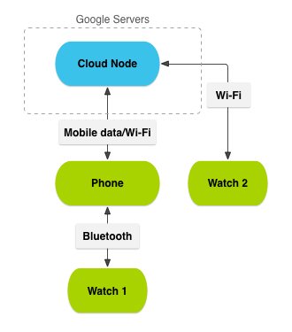

## 发送并同步数据

> 编写:[wly2014](https://github.com/wly2014) - 原文: <http://developer.android.com/training/wearables/data-layer/index.html>

可穿戴数据层API(The Wearable Data Layer API)，Google Play services 的一部分，为手持与可穿戴应用提供了一个交流通道。此API包括一系列的数据对象，其可由系统通过网络和能告知应用数据层重要事件的监听器发送并同步：

**Data Items**

[DataItem](https://developer.android.com/reference/com/google/android/gms/wearable/DataItem.html)提供了手持设备与可穿戴设备间的自动同步的数据储存。

**Messages**

[MessageApi](https://developer.android.com/reference/com/google/android/gms/wearable/MessageApi.html)类可以发送消息和善于处理远程过程调用协议（RPC），比如，从可穿戴设备上控制手持设备的媒体播放器，或在可穿戴设备上启动一个来自手持设备的intent。消息还适合单向请求或者请求/响应通信模型。如果手持设备与可穿戴设备成功连接，那么系统会将传递的消息放进队列并返回一个成功的结果码。否则，会返回一个错误。成功码并不代表成功地传递消息，这是因为设备可能在收到结果码之后断开连接。

**Asset**

[Asset](http://developer.android.com/reference/com/google/android/gms/wearable/Asset.html)对象用于发送如图像这样的二进制数据。将资源附加到数据元，系统会自动负责传递，并通过缓存大的资源来避免重复传送以保护蓝牙带宽。

**WearableListenerService (for services)**

拓展的 [WearableListenerService](http://developer.android.com/reference/com/google/android/gms/wearable/WearableListenerService.html) 能够监听一个service中重要的数据层事件。系统控制 WearableListenerService 的生命周期，并当需要发送数据元或消息时，将其与service绑定，否则解除绑定。

**DataListener (for foreground activities)**

在一个前台activity中实现[DataListener](http://developer.android.com/reference/com/google/android/gms/wearable/DataApi.DataListener.html)能够监听重要的数据通道事件。只有当用户频繁地使用应用时，用此代替WearableListenerService来监听事件变化。

**Channel**

使用 [ChannelApi](http://developer.android.com/reference/com/google/android/gms/wearable/ChannelApi.html) 类来从手持设备传输大的数据项到可穿戴设备，例如音乐和电影。Channel API 用于传输数据有如下的好处：

* 当使用[Asset](http://developer.android.com/reference/com/google/android/gms/wearable/Asset.html)对象附加于[DataItem](https://developer.android.com/reference/com/google/android/gms/wearable/DataItem.html)对象时，在两个或两个以上已连接的设备间传输大的数据文件是不会自动同步。不像[DataApi](http://developer.android.com/reference/com/google/android/gms/wearable/DataApi.html)，Channel API 节省磁盘空间，而[DataApi](http://developer.android.com/reference/com/google/android/gms/wearable/DataApi.html)类是在同步已连接设备之前，就在本地设备上创建一份资源的拷贝。
* 可靠地传输对于使用[MessageApi](https://developer.android.com/reference/com/google/android/gms/wearable/MessageApi.html)类太大的文件。
* 传输数据流，例如从网络服务器下载的音乐或者从麦克风传进来的声音。

> **Warning:** 因为这些Api是为手持设备与可穿戴设备间通信设计，所以我们只能使用这些Api来建立这些设备间的通信。例如，不能试着打开底层sockets来创建通信通道。

Android Wear支持多个可穿戴设备连接到一个手持式设备。例如，当用于在手持设备上保存了一个笔记，它会自动出现在用户的Wear设备上。为了在设备之间同步数据，Google的服务器在设备的网络上设置了一个云节点。系统将数据同步到直连的设备、云节点和通过Wi-Fi连接到云节点的可穿戴设备。

**Figure 1.** 一个包含手持和可穿戴设备节点的实例网络

## Lessons

[访问可穿戴数据层](accessing.html)

这节课展示了如何创建一个客户端来访问数据层API。

[同步数据单元](data-items.html)

数据元是存储在一个复制而来的数据仓库中的对象，该仓库可自动由手持设备同步到可穿戴设备。
    
[传输资源](assets.html)

Asset是典型地用来传输图像和媒体二进制数据。

[发送与接收消息](messages.html)

消息被设计为自动跟踪的消息，可以在手持与可穿戴设备间来回传送。

[处理数据层的事件](events.html)

获知数据层的变化与事件。
