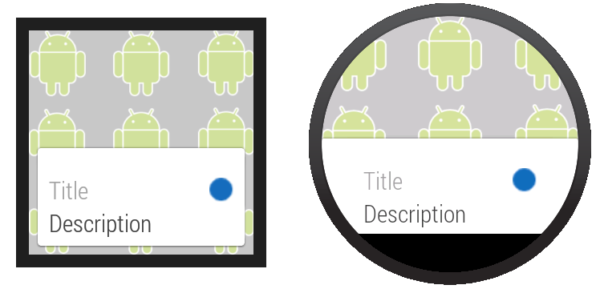

# 创建Card

> 编写: [roya](https://github.com/RoyaAoki) 原文:<https://developer.android.com/training/wearables/ui/cards.html>

Card在不同的应用上以一致的外观为用户显示信息。这个章节介绍如何在Android Wear应用中创建Card。

Wearable UI库提供了为穿戴设备特别设计的Card实现。这个库包含了`CardFrame`类，它将view包在一个Card风格的框架中，该框架有白色的背景、圆角和光投射阴影。`CardFrame`只能包含一个直接子类，通常是一个layout管理器，我们可以向它添加其他views以定制Card内容。

你有两种方法向应用添加Card：

* 使用或继承`CardFragment`类。
* 在layout的`CardScrollView`中添加一个Card。

> **Note:** 这个课程展示了如何在Android Wear activities中添加Card。Android可穿戴设备上的notifications同样以Card的形式显示。更多信息请查看[为Notification赋加可穿戴特性](https://developer.android.com/training/wearables/notifications/index.html)。

## 创建Card Fragment

`CardFragment`类提供一个默认的Card layout，该layout含有一个标题、描述文字和一个图标。如果figure 1的默认Card layout符合你的要求，那么使用这个方法向你的app添加Card。



**Figure 1.** 默认的`CardFragment` layout.

为了添加一个`CardFragment`到应用中，我们需要：

* 在layout中，为包含Card的节点分配一个ID
* 在activity中，创建一个`CardFragment`实例
* 使用fragment管理器将`CardFragment`实例添加到它的容器

下面的示例代码显示了Figure 1中的屏幕显示代码：

```xml
<android.support.wearable.view.BoxInsetLayout
xmlns:android="http://schemas.android.com/apk/res/android"
xmlns:app="http://schemas.android.com/apk/res-auto"
android:background="@drawable/robot_background"
android:layout_height="match_parent"
android:layout_width="match_parent">

    <FrameLayout
        android:id="@+id/frame_layout"
        android:layout_width="match_parent"
        android:layout_height="match_parent"
        app:layout_box="bottom">

    </FrameLayout>
</android.support.wearable.view.BoxInsetLayout>
```

下面的代码添加`CardFragment`实例到Figure 1的activity中：

```java
protected void onCreate(Bundle savedInstanceState) {
    super.onCreate(savedInstanceState);
    setContentView(R.layout.activity_wear_activity2);

    FragmentManager fragmentManager = getFragmentManager();
    FragmentTransaction fragmentTransaction = fragmentManager.beginTransaction();
    CardFragment cardFragment = CardFragment.create(getString(R.string.cftitle),
                                                    getString(R.string.cfdesc),
                                                    R.drawable.p);
    fragmentTransaction.add(R.id.frame_layout, cardFragment);
    fragmentTransaction.commit();
}
```

为了使用`CardFragment`创建一个带有自定义layout的Card，需要继承这个类和重写它的`onCreateContentView`方法。

## 添加CardFrame到Layout

我们也可以直接添加一个Card到layout中，如figure 2所示。当希望为layout文件中的Card自定义一个layout时，使用这个方法。


**Figure 2.** 添加一个`CardFrame`到layout.

下面的layout代码例子示范了一个含有两个节点的垂直linear layout。你可以创建更加复杂的layouts以适合你应用的需要。

```xml
<android.support.wearable.view.BoxInsetLayout
xmlns:android="http://schemas.android.com/apk/res/android"
xmlns:app="http://schemas.android.com/apk/res-auto"
android:background="@drawable/robot_background"
android:layout_height="match_parent"
android:layout_width="match_parent">

    <android.support.wearable.view.CardScrollView
        android:id="@+id/card_scroll_view"
        android:layout_height="match_parent"
        android:layout_width="match_parent"
        app:layout_box="bottom">

        <android.support.wearable.view.CardFrame
            android:layout_height="wrap_content"
            android:layout_width="fill_parent">

            <LinearLayout
                android:layout_height="wrap_content"
                android:layout_width="match_parent"
                android:orientation="vertical"
                android:paddingLeft="5dp">
                <TextView
                    android:fontFamily="sans-serif-light"
                    android:layout_height="wrap_content"
                    android:layout_width="match_parent"
                    android:text="@string/custom_card"
                    android:textColor="@color/black"
                    android:textSize="20sp"/>
                <TextView
                    android:fontFamily="sans-serif-light"
                    android:layout_height="wrap_content"
                    android:layout_width="match_parent"
                    android:text="@string/description"
                    android:textColor="@color/black"
                    android:textSize="14sp"/>
            </LinearLayout>
        </android.support.wearable.view.CardFrame>
    </android.support.wearable.view.CardScrollView>
</android.support.wearable.view.BoxInsetLayout>
```

当`CardScrollView`的内容小于容器时，这个例子上的`CardScrollView`节点让我们可以配置Card的gravity，。这个例子是Card对齐屏幕底部：

```java
@Override
protected void onCreate(Bundle savedInstanceState) {
    super.onCreate(savedInstanceState);
    setContentView(R.layout.activity_wear_activity2);

    CardScrollView cardScrollView =
        (CardScrollView) findViewById(R.id.card_scroll_view);
    cardScrollView.setCardGravity(Gravity.BOTTOM);
}
```

`CardScrollView`检测屏幕形状后以不同的显示方式在圆形或方形设备上显示Card（在圆形屏幕上使用更宽的侧边缘。不管怎样，在`BoxInsetLayout`中放置`CardScrollView`节点然后使用`layout_box="bottom"`属性，这对圆形屏幕上的Card对齐底部并且没有内容被剪裁是很有用的。