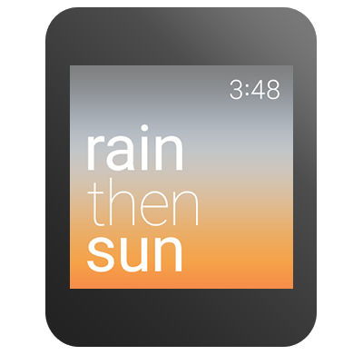
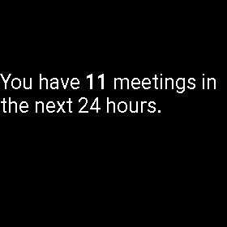

# 在表盘上显示信息

> 编写:[heray1990](https://github.com/heray1990) - 原文: <http://developer.android.com/training/wearables/watch-faces/information.html>

为了显示时间，Android Wear 设备以 cards、notifications 和其它可穿戴应用的形式向用户提供相关的信息。创建自定义表盘不仅可以以丰富的方式显示时间，还可以在用户扫视设备的时候显示相关的信息。

像其它可穿戴应用一样，我们的表盘可以通过[可穿戴数据层 API](http://hukai.me/android-training-course-in-chinese/wearables/data-layer/index.html) 与可穿戴设备上的应用通信。某些情况下，我们需要在工程中的手持式应用模块里创建一个 activity，该 activity 从互联网或者用户的配置文件中检索数据，然后将数据分享给表盘。



**Figure 1.** 表盘集成数据的例子

## 创建丰富的体验

在设计和实现上下文感知的表盘前，先回答下面几个问题：

* 我们想要包含什么类型的数据？
* 我们可以从哪里获得数据？
* 数据多久会显著变化？
* 如何表达数据，使得用户瞥一眼就明白其中的意思？

Android Wear 设备通常与一个带有 GPS 或者蜂窝数据连接的配套设备配对，所以我们有无限的可能来整合不同数据到表盘中，例如位置、日历事件、社交媒体、图片、股票市场报价、新闻事件体育得分等等。然而，并不是所有类型的数据都适合表盘，所以我们需要考虑哪种类型的数据与用户最相关。当可穿戴没有配对的设备或者互联网连接断开时，表盘应该优雅地处理这些情况。

Android Wear 设备上活动的表盘是一个一直在运行的应用，所以我们必须使用高效节能的方法来获取数据。例如，我们每隔10分钟而不是每隔1分钟去获取当前的天气然后将结果保存到本地。当设备从环境模式切换到交互模式时，我们可以刷新上下文数据。这是因为在切换到交互模式时，用户很可能想瞥一眼手表。

由于屏幕的空间有限，并且用户看手表也只是一次看一两秒，所以我们应该在表盘上面将上下文信息归纳起来。有时表达上下文信息最好的方法是用图形和颜色来反应。例如，表盘可以根据当前的天气改变自身的背景图片。

## 添加数据到表盘

Android SDK 中的 *WatchFace* 示例展示了如何在 `CalendarWatchFaceService` 类里从用户的配置文件中获得日程数据，然后显示接下来的24小时有多少个会议。这个示例位于 `android-sdk/samples/android-21/wearable/WatchFace` 目录下。

 

**Figure 2.** 日程表盘

按照下面的步骤实现包含上下文数据的表盘：

1. 提供一个任务来检索数据。
2. 创建一个自定义定时器来周期性地调用任务，或者当外部数据变化时通知表盘服务。
3. 用更新的数据重新绘制表盘。

下面的内容详细介绍了上述几个步骤。

### 提供一个任务来检索数据

在 `CanvasWatchFaceService.Engine` 实现里创建一个继承 [AsyncTask]() 的类。然后添加用于接收我们感兴趣的数据的代码。

下面是 `CalendarWatchFaceService` 类获取第二天会议数量的代码：

```java
/* Asynchronous task to load the meetings from the content provider and
 * report the number of meetings back using onMeetingsLoaded() */
private class LoadMeetingsTask extends AsyncTask<Void, Void, Integer> {
    @Override
    protected Integer doInBackground(Void... voids) {
        long begin = System.currentTimeMillis();
        Uri.Builder builder =
                WearableCalendarContract.Instances.CONTENT_URI.buildUpon();
        ContentUris.appendId(builder, begin);
        ContentUris.appendId(builder, begin + DateUtils.DAY_IN_MILLIS);
        final Cursor cursor = getContentResolver() .query(builder.build(),
                null, null, null, null);
        int numMeetings = cursor.getCount();
        if (Log.isLoggable(TAG, Log.VERBOSE)) {
            Log.v(TAG, "Num meetings: " + numMeetings);
        }
        return numMeetings;
    }

    @Override
    protected void onPostExecute(Integer result) {
        /* get the number of meetings and set the next timer tick */
        onMeetingsLoaded(result);
    }
}
```

Wearable Support 库的 `WearableCalendarContract` 类可以直接存取配套设备用户的日历事件。

当任务检索完数据时，我们的代码会调用一个回调方法。下面的内容详细介绍了如何实现这个回调方法。

更多关于从日历获取数据的内容，请参考 [Calendar Provider](http://developer.android.com/guide/topics/providers/calendar-provider.html) API 指南。

### 创建自定义定时器

我们可以实现一个周期计数的自定义定时器来更新数据。`CalendarWatchFaceService` 类使用一个 [Handler](http://developer.android.com/reference/android/os/Handler.html) 实例通过线程的消息队列来发送和处理延时的消息：

```java
private class Engine extends CanvasWatchFaceService.Engine {
    ...
    int mNumMeetings;
    private AsyncTask<Void, Void, Integer> mLoadMeetingsTask;

    /* Handler to load the meetings once a minute in interactive mode. */
    final Handler mLoadMeetingsHandler = new Handler() {
        @Override
        public void handleMessage(Message message) {
            switch (message.what) {
                case MSG_LOAD_MEETINGS:
                    cancelLoadMeetingTask();
                    mLoadMeetingsTask = new LoadMeetingsTask();
                    mLoadMeetingsTask.execute();
                    break;
            }
        }
    };
    ...
}
```

当可以看到表盘时，这个方法初始化了定时器：

```java
@Override
public void onVisibilityChanged(boolean visible) {
    super.onVisibilityChanged(visible);
    if (visible) {
        mLoadMeetingsHandler.sendEmptyMessage(MSG_LOAD_MEETINGS);
    } else {
        mLoadMeetingsHandler.removeMessages(MSG_LOAD_MEETINGS);
        cancelLoadMeetingTask();
    }
}
```

下面的内容介绍在 `onMeetingsLoaded()` 方法设置下一个定时器。

### 用更新的数据重新绘制表盘

当任务检索完数据时，调用 `invalidate()` 方法使得系统可以重新绘制表盘。将数据保存到 `Engine` 类的成员变量，这样我们就可以在 `onDraw()` 方法中访问数据。

`CalendarWatchFaceService` 类提供一个回调方法给任务在检索完日程数据后调用：

```java
private void onMeetingsLoaded(Integer result) {
    if (result != null) {
        mNumMeetings = result;
        invalidate();
    }
    if (isVisible()) {
        mLoadMeetingsHandler.sendEmptyMessageDelayed(
                MSG_LOAD_MEETINGS, LOAD_MEETINGS_DELAY_MS);
    }
}
```

回调方法将结果保存在一个成员变量中，销毁 view，和调度下一个定时器再次运行任务。