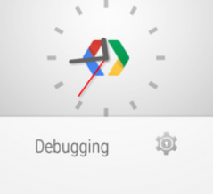

# 定位常见的问题

> 编写:[heray1990](https://github.com/heray1990) - 原文: <http://developer.android.com/training/wearables/watch-faces/issues.html>

创建 Android Wear 的客制化表盘与创建 notification 和可穿戴特有的 activity 的方法不同。这几课介绍如何解决我们在实现第一个表盘时会遇到的一些问题。

## 检测屏幕的形状

一些 Android Wear 设备的屏幕是方形的，另一些是圆形的。圆形屏幕的设备可以在屏幕的底部包含一个插入部分（或者“下巴”）。我们的表盘应该适应和利用好屏幕特定的形状，如 [设计指南](http://developer.android.com/design/wear/watchfaces.html) 中的描述。

Android Wear 让表盘在运行时决定屏幕的形状。为了检测屏幕是方形还是圆形，需要像下面的代码一样重写 `CanvasWatchFaceService.Engine` 类的 `onApplyWindowInsets()` 方法：

```java
private class Engine extends CanvasWatchFaceService.Engine {
    boolean mIsRound;
    int mChinSize;

    @Override
    public void onApplyWindowInsets(WindowInsets insets) {
        super.onApplyWindowInsets(insets);
        mIsRound = insets.isRound();
        mChinSize = insets.getSystemWindowInsetBottom();
    }
    ...
}
```

当重新绘制表盘时，检查成员变量 `mIsRound` 和 `mChinSize` 的值来适应我们的设计。

## 容纳 Card

当用户接收到一个 notification，notification card 可能会遮盖屏幕很大一部分，这取决于[系统 UI 的风格](http://hukai.me/android-training-course-in-chinese/wearables/watch-faces/drawing.html#SystemUI)。表盘应该适应这些情况，确保当 notification card 出现时用户仍然可以看到时间。

当 notification card 出现时，模拟表盘需要调整，如缩小表盘使得自身不被 card 覆盖。数字表盘在屏幕显示时间的区域不会被 card 覆盖，通常不需要作出调整。使用 `WatchFaceService.getPeekCardPosition()` 方法确定在 card 上方可用于调整表盘的空间。



**Figure 1.** 当 notification card 出现时，一些模拟表盘需要调整

在环境模式下，card 的背景是透明的。如果我们的表盘在环境模式下，card 的附近包含详细的信息，那么可以考虑在 card 的上面绘制一个黑色方块，确保用户可以读到 card 的内容。

## 配置系统指示图标

为了确保系统指示图标一直可见，当创建一个 `WatchFaceStyle` 实例时，我们可以将配置系统指示图标在屏幕的位置和决定是否需要背景保护：

* 使用 `setStatusBarGravity()` 方法设置状态栏的位置。
* 使用 `setHotwordIndicatorGravity()` 方法设置热词的位置。
* 使用 `setViewProtection()` 方法，用一个灰色的半透明背景保护状态栏和热词。由于系统指示图标是白色的，如果我们的表盘背景是明亮的，这样做事很必要的。


**Figure 2.** 状态栏

更多关于系统指示图标的内容，请查看[配置系统 UI](http://hukai.me/android-training-course-in-chinese/wearables/watch-faces/drawing.html#SystemUI) 和 [设计指南](http://developer.android.com/design/wear/watchfaces.html)。

## 使用相对尺寸

不同厂商的 Android Wear 设备屏幕会有不同的尺寸和分辨率。我们的表盘应该通过使用相对尺寸而不是绝对像素值来适应这些差异。

当我们绘制表盘时，用 [Canvas.getWidth()](http://developer.android.com/reference/android/graphics/Canvas.html#getWidth()) 和 [Canvas.getHeight()](http://developer.android.com/reference/android/graphics/Canvas.html#getHeight()) 方法获得画布的尺寸，然后以屏幕尺寸一部分所占比例的值来设置图片的位置。如果重新绘制表盘的组件来响应 card，那么根据屏幕里 card 上方剩下空间所占比例的值来重新绘制表盘。